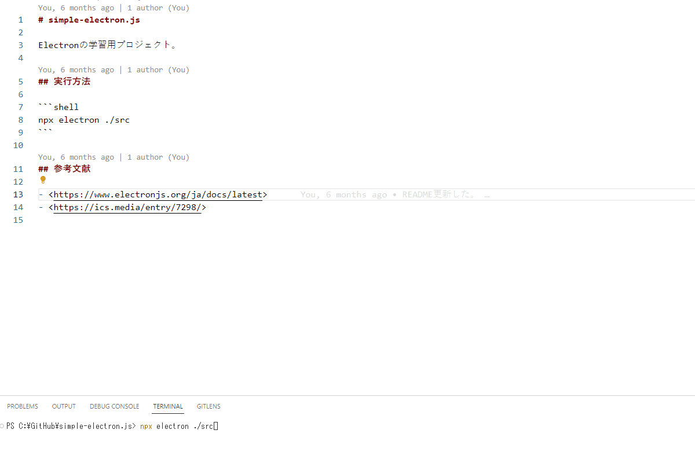

# simple-electron.js

Electronの学習用プロジェクト。  

  

## 実行方法

```shell
npx electron ./src
```

## 参考文献

- <https://www.electronjs.org/ja/docs/latest>
- <https://ics.media/entry/7298/>

<!--
```shell
git config --global --add safe.directory /workspaces/simple-electron.js
git config gpg.program gpg
```
-->
